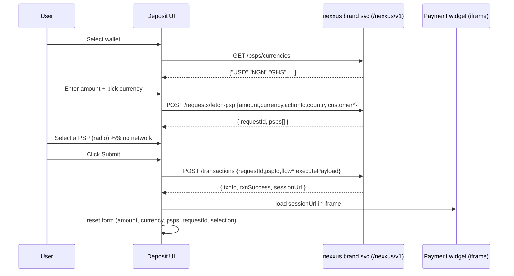

# Nexxus Deposit — Flow & API Reference

End-to-end documentation of the deposit flow, and exactly which nexxus brand-service API is
called at each step.

---

## 1. Connection & auth

| Concern | How |
|---|---|
| Base URL | `VITE_API_BASE_URL` (empty in dev) + `VITE_NEXXUS_API_PREFIX` (`/nexxus/v1`) → see [`src/api/api-client.ts`](../src/api/api-client.ts) |
| Host | Hosted brand service at **`https://api.nexxus.fynxt.io`** |
| Dev CORS | Vite proxy forwards same-origin `/nexxus/*` → `VITE_API_TARGET` (server-to-server, strips browser headers) → see [`vite.config.ts`](../vite.config.ts) |
| Auth | Every request carries the **`x-secret-token`** header (`VITE_SECRET_TOKEN`). The brand + environment are resolved from that token server-side — no brand/env ids are sent by the client. |

Auth header is injected by the axios request interceptor in `api-client.ts`:

```ts
function authHeaders() {
    const secretToken = import.meta.env.VITE_SECRET_TOKEN;
    return secretToken ? { 'x-secret-token': secretToken } : {};
}
```

---

## 2. The flow (step by step)

| # | User action | What happens | API call |
|---|-------------|--------------|----------|
| 1 | App loads | Wallet cards render from static config ([`config.ts` → `WALLETS`](../src/features/deposit/config.ts)) | — (no API) |
| 2 | **Select a wallet** | The deposit form (amount + "Supported currency") appears | — |
| 3 | (on wallet select) | The **Supported currency** dropdown is populated | **`GET /psps/currencies`** |
| 4 | Enter **amount** + pick a **currency** | Debounced (500ms) auto-fetch of providers; amount is FX-converted wallet→currency | **`POST /requests/fetch-psp`** |
| 5 | Provider **radio cards** render | Select one → only sets local selection (no network) | — |
| 6 | Click **Submit** | Creates the transaction for the selected PSP | **`POST /transactions`** |
| 7 | Payment renders | `sessionUrl` is loaded full-screen in a sandboxed **iframe**; the form **resets in the background** | — (iframe loads the hosted widget) |

> **Single-use token:** the `requestId` returned by `fetch-psp` is consumed by one
> `transactions` call. After submit the form resets so the next deposit re-runs
> `fetch-psp` for a fresh `requestId`.

### Sequence diagram



---

## 3. API reference

All three are defined in [`src/api/endpoints.ts`](../src/api/endpoints.ts), called through
[`src/features/deposit/services/deposit.service.ts`](../src/features/deposit/services/deposit.service.ts),
and wrapped in hooks under [`src/features/deposit/hooks/`](../src/features/deposit/hooks).
Responses are unwrapped from the brand-service envelope `{ code, message, data, timestamp }` (see `api-client.ts` → `unwrap()`).

### 3.1 `GET /psps/currencies` — supported currencies

- **Purpose:** populate the "Supported currency" dropdown (brand-wide supported currencies).
- **Auth:** `x-secret-token`.
- **Called from:** `DepositService.getSupportedCurrencies()` → hook `useCurrencies()` (a TanStack `useQuery`) → used in `deposit-page.tsx`. Falls back to the wallet's `supportedCurrencies` if the call fails/returns empty.
- **Response (`data`):** array of currency codes (or objects normalized to codes), e.g. `["USD","NGN","GHS","EUR", ...]`.

### 3.2 `POST /requests/fetch-psp` — list available PSPs

- **Purpose:** given amount/currency/customer context, return the eligible payment providers + a `requestId`.
- **Auth:** `x-secret-token`.
- **Called from:** `DepositService.fetchPsp()` → hook `useFetchPsp()` (a `useMutation`) → triggered by the **debounced auto-fetch `useEffect`** in `deposit-page.tsx` whenever wallet / currency / converted-amount change.
- **Request body** (`FetchPspRequest`, built in `deposit-page.tsx`; static fields from `config.ts → REQUEST_CONTEXT`):

```jsonc
{
  "amount": 1580,            // FX-converted amount, in `currency`
  "currency": "NGN",         // selected supported currency
  "actionId": "fat_3v1UUaAwNVQunEoJTZ8oz9pYLW",  // REQUEST_CONTEXT.actionId
  "country": "US",           // REQUEST_CONTEXT.country
  "customerId": "cust_001",
  "customerTag": "VIP",
  "customerAccountType": "INDIVIDUAL"
}
```

- **Response** (`data` = `FetchPspResponse`):

```jsonc
{
  "requestId": "742f7018-...",
  "psps": [
    {
      "id": "c5885f61-...",
      "name": "Korapay",
      "description": "<html …>",     // rich HTML (stripped for display)
      "logo": "data:image/svg+xml;base64,…",
      "flowActionId": "fat_…",
      "flowDefintionId": "fld_…",     // NOTE: backend spelling ("Defintion")
      "currency": "NGN",
      "originalAmount": 1580,
      "totalAmount": 1580,
      "appliedFeeAmount": 0,          // optional
      "netAmountToUser": 0,           // optional
      "feeApplied": false,            // wire field is `feeApplied`, not `isFeeApplied`
      "flowTarget": { "flowTargetId": "ftg_…", "inputSchema": "{…json…}" }
    }
  ]
}
```

### 3.3 `POST /transactions` — create the transaction

- **Purpose:** create the transaction for the selected PSP and get a payment `sessionUrl`.
- **Auth:** `x-secret-token`.
- **Called from:** `DepositService.createTransaction()` → hook `useCreateTransaction()` (a `useMutation`) → invoked **only by the `Submit` button** (`handleSubmit` in `deposit-page.tsx`). Selecting a PSP does NOT call this.
- **Request body** (`CreateTransactionRequest`, built in `handleSubmit` from the selected PSP + `config.ts → CUSTOMER_PROFILE`):

```jsonc
{
  "requestId": "742f7018-...",        // from fetch-psp (single-use)
  "pspId": "c5885f61-...",
  "flowActionId": "fat_…",
  "flowTargetId": "ftg_…",
  "flowDefinitionId": "fld_…",
  "externalRequestId": "extn_…",       // generated per attempt
  "transactionType": "deposit",
  "txnCurrency": "NGN",
  "txnAmount": 1580,                   // psp.totalAmount
  "txnFee": 0,                         // psp.appliedFeeAmount ?? 0
  "executePayload": {
    "body": {
      "order": {
        "id": "1758848508",
        "money":   { "amount": 1580, "currency": "NGN" },       // PSP side
        "crmData": { "amount": 1, "currency": "USD", "conversionRate": 1580 }, // wallet side
        "timestamp": "1758848508"
      },
      "customer": {
        "id": "cust_001", "firstName": "…", "lastName": "…",
        "email": "…", "phone": { "phoneNumber": "…", "countryCode": "…" },
        "address": { "line1": "…", "city": "…", "state": "…", "zipCode": "…", "country": "…" }
      },
      "language": "en",
      "customAttributes": {}
    }
  }
}
```

- **Response** (`data` = `CreateTransactionResponse`):

```jsonc
{
  "txnId": "ortx…",
  "txnSuccess": true,
  "txnMeta": { /* PSP init details, e.g. Korapay checkout */ },
  "txnError": null,
  "sessionUrl": "https://widget.nexxus.fynxt.io/<token>"   // loaded in the iframe
}
```

### 3.4 Payment iframe (no direct API call)

`sessionUrl` = `${widgetUrl}/${sessionToken}`. It's loaded in a sandboxed `<iframe>`
([`components/iframe-payment.tsx`](../src/features/deposit/components/iframe-payment.tsx)).
The hosted widget itself calls `GET /sessions/{token}` to render the gateway — the deposit
UI does not call it directly.

---

## 4. State & behavior notes (`deposit-page.tsx`)

- **Currency default:** the dropdown defaults to a `"Select currency"` placeholder and never auto-picks; it only resets to the placeholder if the current choice leaves the option list.
- **Auto-fetch:** a debounced `useEffect` on `[walletId, currency, convertedAmount]` calls `fetch-psp`; any input change clears the current PSP selection.
- **FX conversion:** amount is entered in the wallet currency and converted to the selected currency via `utils/conversion.ts` (indicative rates in `config.ts`); the converted value is what's sent as `amount`.
- **Submit only:** `POST /transactions` fires only from the Submit button, for the selected PSP.
- **Reset after submit:** on success the form (amount, currency, psps, requestId, selection) is cleared in the background while the iframe shows the gateway — guaranteeing a fresh `requestId` for the next deposit.
